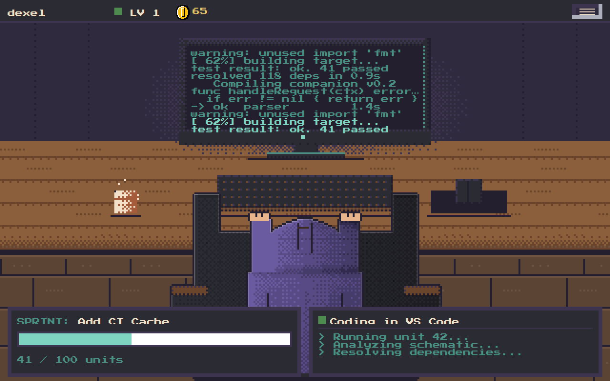
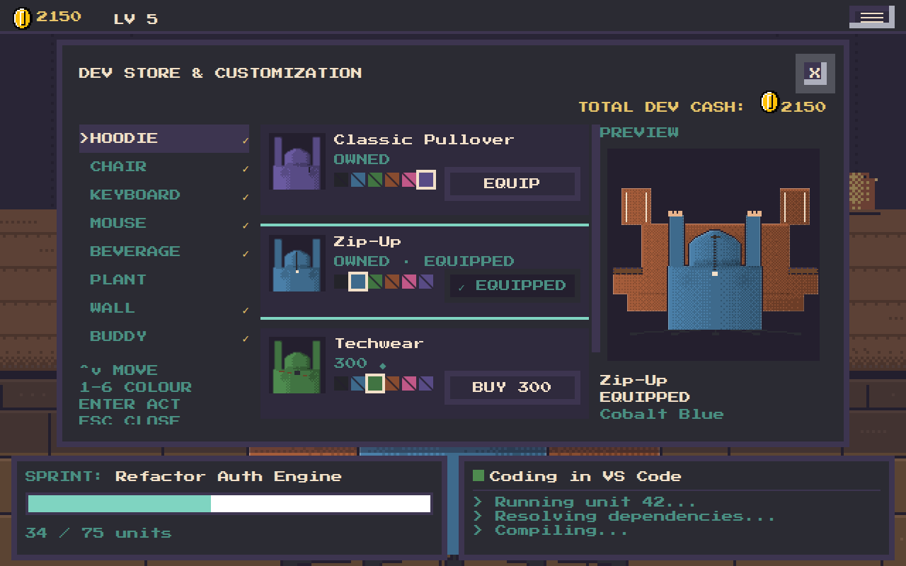
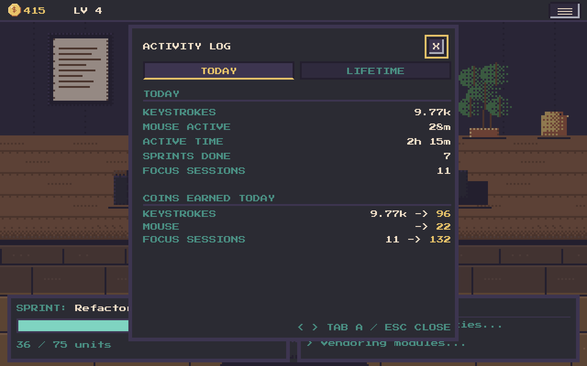
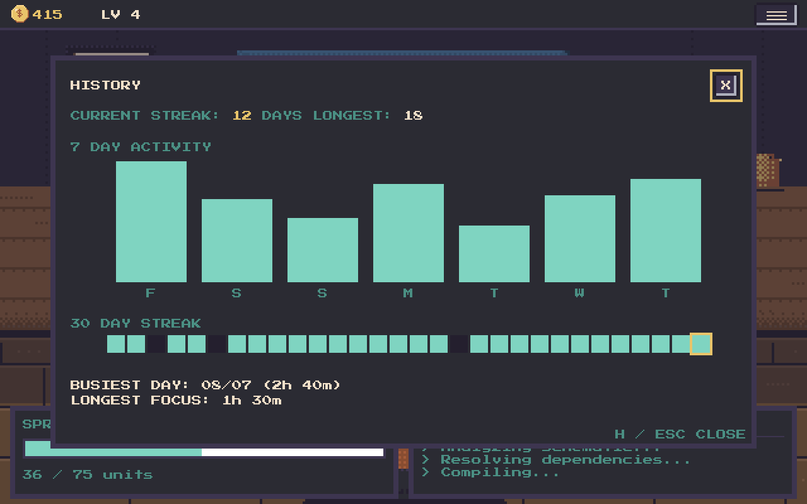

<div align="center">

# Dexel

**A cozy pixel-art desktop companion whose workday runs on *your* real typing.**

[](https://github.com/jawwadzafar/dexel/actions/workflows/build.yml)
[](https://github.com/jawwadzafar/dexel/releases/latest)
[](#platforms)
[](LICENSE)



</div>

## What is dexel

`dexel` is a small pixel-art developer who lives at a desk on your screen. Your
real typing — in **any** app, not just the game window — advances their current
sprint, and finishing a sprint pays out coins you spend in a store on hoodies,
chairs, keyboards, plants, and more, all of which actually render on the
character and desk.

There are no meters, no hunger, nothing to feed or lose. It's pure idle: leave
it running, keep working, and watch the desk fill in. And it never reads *what*
you type — only that you did. See [Privacy](#privacy).

## Install

One line, and dexel is installed, added to your app grid, and running. No
`sudo`, no elevation, no autostart.

**Linux** (also Windows via Git Bash / MSYS2 / Cygwin, and WSL):

```bash
curl -fsSL https://raw.githubusercontent.com/jawwadzafar/dexel/main/install.sh | bash
```

**Windows** (PowerShell):

```powershell
irm https://raw.githubusercontent.com/jawwadzafar/dexel/main/install.ps1 | iex
```

**macOS:** [build from source](#build-from-source) — one `go build` and you're
running.

Remove it any time with `dexel uninstall` (add `--purge` to delete your save
too). It's the exact reversal of the install and never touches anything outside
your home directory.

## Features

- **Runs on your real typing.** Global keystroke and mouse *counts* advance
  sprints — from whatever app you're actually working in.
- **Sprints → Cash → store.** Completed sprints pay coins. Spend them in a store
  with per-slot tabs, colours as buyable items, click-to-preview, and
  level-locked items that unlock as you level up.
- **Honest by design.** Moods and idle time only reflect what the platform can
  actually see. If it can't see globally, it freezes rather than guessing — it
  never claims a workday it didn't witness.
- **Analytics & history.** An activity log (Today / Lifetime), a 30-day history
  with streaks and insights, and a per-signal breakdown of how coins were
  earned — all derived from counts, never content.
- **Cozy details.** A gold coin HUD, sound effects, click reactions, and
  pixel-art generated from committed code so every sprite is a reviewable diff.
- **One self-contained binary.** A Go backend embeds the frontend and every
  sprite — nothing to unpack. An optional native desktop app (a frameless
  window) is available via [Tauri](https://tauri.app/).

## Screenshots

| Store | Activity | History |
|---|---|---|
|  |  |  |

Press `S` for the store, `A` for the activity log, `H` for history, `W` for
sessions, and `Esc` to close. Full contract in
[`docs/ui-spec.md`](docs/ui-spec.md).

## Privacy

Privacy is the project's defining constraint, not a footnote.

- **Counts and durations only, never content.** Dexel records *that* a key was
  pressed and *that* the mouse moved — never which key, never any typed text,
  never the clipboard.
- **App names, never window titles.** The foreground-app signal is an app name
  (e.g. "Visual Studio Code") — never a window title, document, or URL.
- **Enforced by tests, not by promise.** A structural allow-list test *fails the
  build* if anyone adds a field to the activity types whose name even smells like
  content (`title`, `text`, `clipboard`, `keycode`, …).
- **100% local.** Everything runs on your machine over loopback. Nothing phones
  home.

## Build from source

Requires [Go 1.27+](https://go.dev/dl/). Node/npm are **not** needed to run the
game — the compiled frontend bundle and all sprites are embedded at build time.

```bash
git clone https://github.com/jawwadzafar/dexel.git
cd dexel/app
go build -o dexel .        # Windows: go build -o dexel.exe .
./dexel                    # starts the runtime and opens the game
```

macOS builds the same way (Xcode Command Line Tools supply the C compiler the
mac activity provider needs).

### The `dexel` CLI

`dexel` with no arguments starts the background runtime and opens the game;
closing the window doesn't stop it. Some of the rest:

| Command | What it does |
|---|---|
| `dexel status` | is a runtime running? pid, port, url, version, paused (`--json`) |
| `dexel pause` / `resume` | stop / start observing activity |
| `dexel update` | update to the latest release in place, preserving your save |
| `dexel uninstall` | remove dexel from this machine (`--purge` drops your save too) |
| `dexel doctor` | a diagnostics report (versions, paths, runtime) to paste in an issue |
| `dexel help` | the full command list |

## Platforms

The server runs on every platform Go supports. What differs is whether it can
see your typing *globally* — which is what advances sprints.

| OS | Global activity capture | Setup |
|---|---|---|
| **macOS** | Yes — permissionless | None (reads a system idle-time delta, no Accessibility prompt). |
| **Linux** | Yes | `sudo usermod -aG input "$USER"`, then log out and back in. |
| **Windows** | Yes — permissionless | None (low-level keyboard/mouse hooks that count events, never identify them). |
| Any other OS | No native provider | Runs, but blind. |

Without global capture, dexel still runs — it just counts activity only while
the game window has focus, and freezes idle rather than guessing.

## Documentation

[`docs/README.md`](docs/README.md) is the index: how the game works today
([`docs/game/`](docs/game/README.md)), why each decision was made
([`docs/adr/`](docs/adr/README.md)), and what's next
([`docs/plan/ROADMAP.md`](docs/plan/ROADMAP.md)).

## License

Dexel is licensed under the **[MIT License](LICENSE)** — Copyright (c) 2026
Jawwad Zafar. Free to use, modify, distribute, and sell; redistributions must
retain the copyright notice and the [`LICENSE`](LICENSE) text. The license
covers the code, not the *dexel* name or character as a trademark.

Bundled third-party components and their licenses are listed in
[`THIRD-PARTY-LICENSES.md`](THIRD-PARTY-LICENSES.md). Contributions are welcome —
see [`CONTRIBUTING.md`](CONTRIBUTING.md).
</content>
</invoke>
