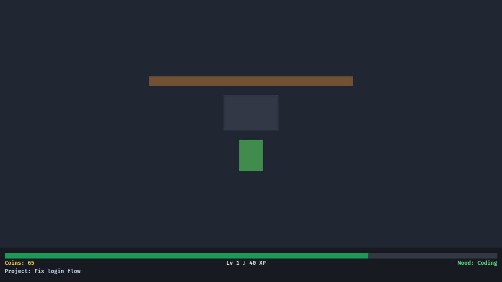

# dev-companion

> A cozy desktop companion for developers. The little character at the desk
> codes *while you* work — its progress is driven by your real activity
> (typing, mouse movement), never by the content of what you're typing.
> Idle for a bit and it takes a break.

[](https://www.rust-lang.org/)
[](https://bevyengine.org/)
[](#license)
[](https://github.com/jawwadzafar/dev-companion/releases)

<p align="center">
  
</p>

---

## Quick start

**Requirements**

- Rust stable (1.97 or newer) — `rustup`
- A display (the game is a windowed desktop app)
- A C linker on your system (or a `CC` in your environment)

```bash
git clone git@github.com:jawwadzafar/dev-companion.git
cd dev-companion

# Run it — a window opens, your developer companion starts working
cargo run -p companion
```

That's it. Type in the window and watch the progress bar fill, coins accrue,
and your level rise. Idle for 60 seconds and the companion goes **OnBreak**.

> **No system C toolchain?** This repo is built with a Zig-based `cc` shim.
> Source `~/.cargo/devcompanion-env.sh` first if you're on the same machine as
> the fleet (it sets `CC`, `PKG_CONFIG`, and `LD_LIBRARY_PATH`). On a normal
> dev box with a standard toolchain you can skip that.

### Quick run (one-liner)

```bash
cargo run -p companion
```

### Release build

```bash
cargo build --release -p companion
./target/release/companion
```

### Build for multiple architectures (x86_64 + ARM)

`scripts/build.sh` builds release binaries for one or more targets into
`./build/` (git-ignored):

```bash
./scripts/build.sh              # x86_64 (native) — always works
./scripts/build.sh x86_64       # x86_64 only
./scripts/build.sh all          # x86_64 + aarch64 (ARM)
./scripts/build.sh arm          # aarch64 (gnu)
./scripts/build.sh arm-musl     # aarch64 (musl, static)
```

Binaries land in `build/<target>/companion`.

> **ARM cross-build needs a sysroot.** Bevy links native windowing libraries
> (wayland, gbm, alsa, x11). Building those for aarch64 from an x86_64 host
> requires an **aarch64 sysroot** (the target's C libs + headers). Two ways:
>
> - **`cross` (Docker) — recommended.** It provisions a real aarch64
>   toolchain + glibc, so everything resolves:
>   ```bash
>   cross build --release --target aarch64-unknown-linux-gnu -p companion
>   ```
> - **`scripts/build.sh arm`** with `ARM_SYSROOT=/path/to/aarch64/sysroot`
>   set (the script wires zig as the C compiler/linker + a pkg-config shim).
>
> On a machine with sudo you can generate the sysroot with
> `cross build` or an aarch64 Docker image. See the header comment in
> `scripts/build.sh` for details.

### Seeded / demo save (optional)

The game autosaves every 30 s and restores on launch. To start with a
populated HUD immediately, seed the save file
(`~/.local/share/dev-companion/save.json` on Linux):

```json
{
  "wallet": 65,
  "xp": 40,
  "level": 1,
  "current_project": { "index": 2, "work_done": 36.9 }
}
```

Cross-platform save location (via the [`dirs`](https://crates.io/crates/dirs)
crate):

| OS | Path |
|---|---|
| Linux | `~/.local/share/dev-companion/save.json` |
| macOS | `~/Library/Application Support/dev-companion/save.json` |
| Windows | `%APPDATA%/dev-companion/save.json` |

---

## What it does

| Feature | Detail |
|---|---|
| **Activity-driven progress** | Typing / mouse motion in the focused window drives a decaying events/s rate, which fills the current project's progress bar. |
| **Anti-mashing clamp** | The rate is capped (`MAX_RECENT_RATE` = 120 ev/s) and work is added linearly in rate, so hammering the keyboard can't outpace real typing. |
| **Projects** | A static rotation of 4 projects ("Fix login flow", "Refactor config loader", "Add CI cache", "Write API docs"). Finishing one awards coins + XP and rolls the next. |
| **Leveling** | XP → level via a classic quadratic threshold (`level_for_xp`). |
| **Mood** | `Idle` → `Coding` on fresh activity → `OnBreak` after 60 s of no input (with a personality line: "Maybe we should take a break?"). |
| **Desk upgrade** | At 50 coins a placeholder plant appears on the desk — the "world visibly changes" hook. |
| **Persistence** | `serde`/`serde_json` save, autosaved every 30 s, restored on launch. No user content is ever persisted (only wallet, XP, and the project index + progress). |

**Privacy by design:** the activity layer records only *counts* and focus
transitions — never key identity, text, or window titles.

---

## Project layout

```
dev-companion/
├── Cargo.toml              # workspace root
├── activity/               # plain-Rust lib — the ActivityProvider boundary (NO Bevy)
│   └── src/lib.rs
├── companion/              # the Bevy game (binary + lib)
│   ├── src/main.rs         # thin entry → companion::run()
│   ├── src/lib.rs          # scene, systems, save/load, UI
│   └── tests/m2_smoke.rs   # app-driven integration test
├── tools/
│   └── shotcap/            # dev/verification tool: in-process framebuffer capture
├── scripts/
│   └── visual-check.py     # ask a vision model about a screenshot (HTTP)
└── docs/
    ├── implementation-plan.md   # architecture + milestone plan
    ├── milestone-log.md         # per-milestone build log
    ├── pr-log.md                # PR review/merge decisions
    └── screenshot.png           # hero image (this README)
```

**The architecture boundary** (see `docs/implementation-plan.md` §3.1):
`activity` is a dependency-free lib crate. `companion` (Bevy) consumes it and
*forwards* Bevy input events into an `ActivityProvider`; no game system ever
reads input directly. Swapping in a real OS-global activity listener later is a
one-crate change.

---

## Development

### The standard command sequence (run after every change)

```bash
cargo fmt --all -- --check
cargo clippy --workspace --all-targets -- -D warnings
cargo test --workspace
cargo run -p companion
```

### Fast dev loop

```bash
cargo run -p companion
```

### Debug (more logs)

```bash
RUST_LOG=debug,wgpu=warn RUST_BACKTRACE=1 cargo run -p companion
```

### Release / multi-arch

```bash
./scripts/build.sh              # x86_64 (native)
./scripts/build.sh all          # x86_64 + aarch64 (ARM, needs sysroot/cross)
cross build --release --target aarch64-unknown-linux-gnu -p companion   # ARM via Docker
```

### CI / GitHub Actions (self-hosted runner)

The repo runs its pipelines on a **self-hosted GitHub runner** (`jwdlab-runner`,
labels `self-hosted`/`Linux`/`X64`/`darkmirror`). Because the repo is private,
GitHub's hosted runners (`ubuntu-latest`/`macos-latest`) are unavailable, so
every job is pinned to `runs-on: [self-hosted, darkmirror]`.

- **`build.yml`** (on push/PR + `workflow_dispatch`): builds the Linux targets
  and uploads them as artifacts.
  - `linux-x86_64` — native
  - `linux-arm64` — cross via `cross` (Docker provides the aarch64 glibc sysroot)
- **`release.yml`** (on a `v*` tag, or manual): builds all targets and publishes
  a **GitHub Release** with the binaries as assets.
  - `linux-x86_64`, `linux-arm64` — built on the runner
  - `macos-arm64` — **gated**: only built when a macOS runner with the `mac`
    label is registered (a Linux runner cannot produce a macOS binary). Until
    then the job skips with a clear warning.

Trigger a build manually:

```bash
gh workflow run build.yml
# or create a release:
git tag v0.1.0 && git push origin v0.1.0
```

> **macOS arm64:** to get an Apple Silicon binary, register a macOS runner with
> the `mac` label (then `release.yml` picks it up), or build it locally on a
> Mac: `rustup target add aarch64-apple-darwin && cargo build --release --target aarch64-apple-darwin -p companion`.

### Visual verification (no compositor / headless CI)

`tools/shotcap` builds the **real** game app with a seeded save and captures
its own framebuffer to PNG via Bevy's `Screenshot` component — no window
manager, X server, or screenshot tool required. Useful on headless CI or any
session without a live display.

```bash
# Capture frames to /tmp/shotcap-out (seeded: wallet 65, 40 XP, 36.9 work)
cargo run -p shotcap

# Then ask a vision model what it sees:
python3 scripts/visual-check.py /tmp/shotcap-out/shot_5s.png \
  "Describe every UI element: is there a bottom bar with a progress bar and text (coins, level, mood, project)? Is there a desk area above it?"
```

`shotcap` env vars: `DEV_COMPANION_SEED_COINS`, `DEV_COMPANION_SEED_XP`,
`DEV_COMPANION_SEED_WORK_DONE`, `SHOTCAP_OUT` (output dir), `SHOTCAP_EXIT_SECS`
(default 7).

---

## Testing

```bash
cargo test --workspace
```

39 tests: pure-function unit tests (`decay_and_accumulate`, `progress_delta`,
`level_for_xp`, save round-trip), app-driven integration tests (M2 smoke, M4
quit/relaunch restore, M5 desk upgrade), and a layout-relationship test
asserting the HUD is a child of the desk root (regression guard for the HUD
rendering fix).

---

## Architecture at a glance

```
OS / window input
        │
        ▼
┌─────────────────────────────┐
│  activity crate (no Bevy)    │  trait ActivityProvider
│  FocusedWindowProvider       │  ← fed by Bevy input, never read by game systems
└──────────────┬───────────────┘
               │ ActivityEvent (count/kind only — never key identity)
               ▼
┌─────────────────────────────┐
│  companion crate (Bevy)      │
│  activity_bridge_system      │
│        │  ActivityMeter      │
│        ▼                     │
│  mood + progress systems     │  (ECS, FixedUpdate/Update)
│        ▼                     │
│  UI / HUD systems            │  (Bevy UI)
│        ▼                     │
│  save_system (serde_json)    │  (autosave every 30 s)
└─────────────────────────────┘
```

Full details — ECS components/resources/systems, the activity boundary, and
the milestone plan — live in [`docs/implementation-plan.md`](docs/implementation-plan.md).

---

## Roadmap (post-v0.1)

Explicitly **out of scope for v0.1** but shaped for: global OS-level activity
(replacing `FocusedWindowProvider`), VS Code / Git / GitHub signals, AI
coding-agent activity, career tree / multiple rooms / town, packaging &
auto-update, Steam achievements. See the plan's "explicitly not in this plan"
section.

---

## License

MIT OR Apache-2.0 — see [`Cargo.toml`](Cargo.toml).
